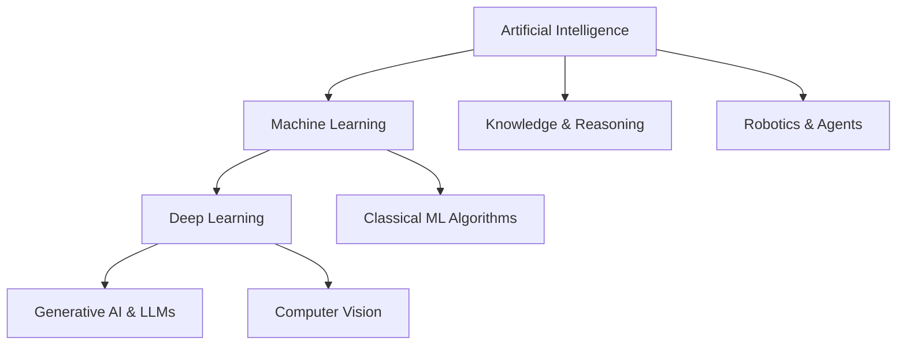

# Artificial Intelligence (AI)

Artificial Intelligence (AI) is the science and engineering of making machines capable of performing tasks that typically require human intelligence. This includes visual perception, speech recognition, decision-making, and language translation.

## Key Sub-Disciplines

1. **Machine Learning (ML)**: Developing systems that learn patterns from data rather than following strictly hardcoded rules.
2. **Deep Learning (DL)**: Hierarchical representation learning using multi-layered artificial neural networks.
3. **Reinforcement Learning (RL)**: Goal-oriented agent learning via environmental rewards and trial-and-error.

> "The goal of AI is not to mimic human thought processes perfectly, but to create systems that can solve problems that humans find hard or tedious."
