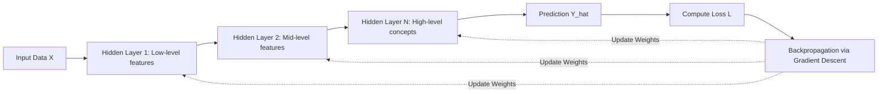

# Deep Learning

Deep Learning is a subset of machine learning based on artificial neural networks with representation learning. The adjective "deep" refers to the use of multiple layers in the network.

## Universal Approximation Theorem
A feedforward network with a single hidden layer containing a finite number of neurons can approximate continuous functions on compact subsets of $\mathbb{R}^n$, under mild assumptions on the activation function:

$$f(x) = \sum_{i=1}^m c_i \sigma(w_i^T x + b_i)$$

where:
- $w_i \in \mathbb{R}^n$ are weight vectors
- $b_i \in \mathbb{R}$ are biases
- $\sigma(\cdot)$ is a non-linear activation function (e.g. ReLU, GELU, Sigmoid)

## Deep Learning Workflow

## Core Architectures
- **CNNs**: Specialized for spatial grid data (images, video).
- **RNNs / LSTMs**: Specialized for sequential data (historical time series).
- **Transformers**: State of the art for sequences, language, and multimodal tasks using self-attention.
