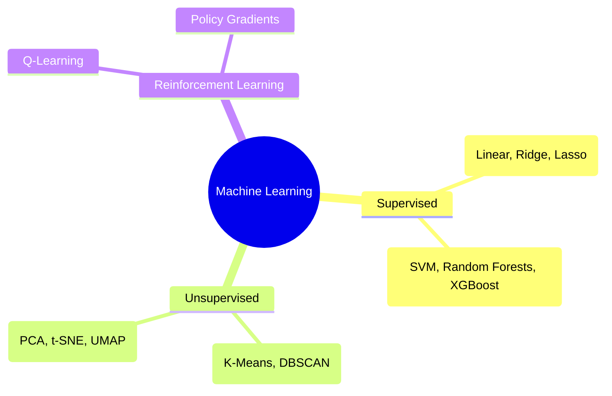

# Machine Learning Foundations

Machine learning focuses on algorithms that build mathematical models based on sample data ("training data") to make predictions or decisions without being explicitly programmed.

## The Fundamental Machine Learning Paradigm

$$\min_{\theta} \frac{1}{N} \sum_{i=1}^N \mathcal{L}(f_\theta(x_i), y_i) + \lambda \mathcal{R}(\theta)$$

Where:
- $\theta$: Model parameters (weights and biases)
- $\mathcal{L}(\hat{y}, y)$: Loss function measuring prediction error
- $\mathcal{R}(\theta)$: Regularization penalty ($L_1$ Lasso or $L_2$ Ridge)
- $\lambda$: Regularization hyperparameter preventing overfitting
