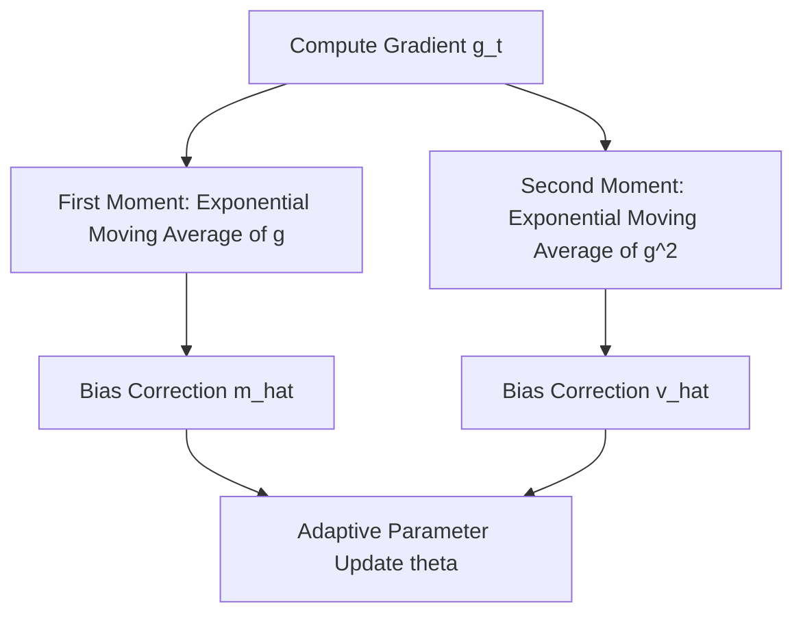

# Optimization & Gradient Descent

Gradient descent is the primary workhorse algorithm used to minimize differentiable objective loss functions in machine learning.

## Gradient Descent Update Rule

The parameters $\theta$ are iteratively updated in the direction opposite to the gradient:

$$\theta_{t+1} = \theta_t - \eta \nabla_\theta \mathcal{L}(\theta_t)$$

where $\eta > 0$ is the learning rate.

## Adam Optimizer (Adaptive Moment Estimation)

Adam combines the advantages of **Momentum** (first moment) and **RMSprop** (second raw moment):

1. Compute gradients: $g_t = \nabla_\theta \mathcal{L}(\theta_t)$
2. Update biased first moment estimate:
   $$m_t = \beta_1 m_{t-1} + (1 - \beta_1) g_t$$
3. Update biased second raw moment estimate:
   $$v_t = \beta_2 v_{t-1} + (1 - \beta_2) g_t^2$$
4. Compute bias-corrected estimates:
   $$\hat{m}_t = \frac{m_t}{1 - \beta_1^t}, \quad \hat{v}_t = \frac{v_t}{1 - \beta_2^t}$$
5. Update parameters:
   $$\theta_{t+1} = \theta_t - \frac{\eta}{\sqrt{\hat{v}_t} + \epsilon} \hat{m}_t$$

