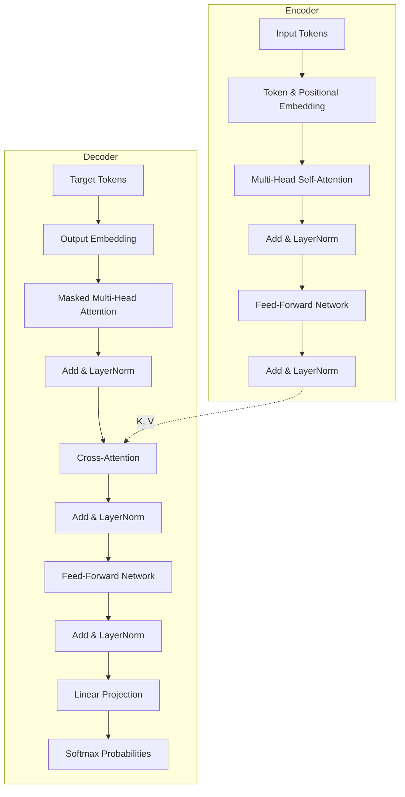

# Transformer Architecture

Introduced in the seminal 2017 paper *"Attention Is All You Need"* by Vaswani et al., the Transformer revolutionized Natural Language Processing and Deep Learning by replacing recurrent connections with parallelizable **Self-Attention**.

## Architecture Overview

## Why Transformers Dominate
1. **Full Parallelization**: Unlike RNNs where token $t$ depends on step $t-1$, Transformers process all sequence tokens simultaneously.
2. **Direct Long-Range Dependency**: Path length between any two tokens in a sequence is $O(1)$ compared to $O(N)$ in RNNs.
3. **Scalability**: Follows empirical scaling laws with parameters and compute.
