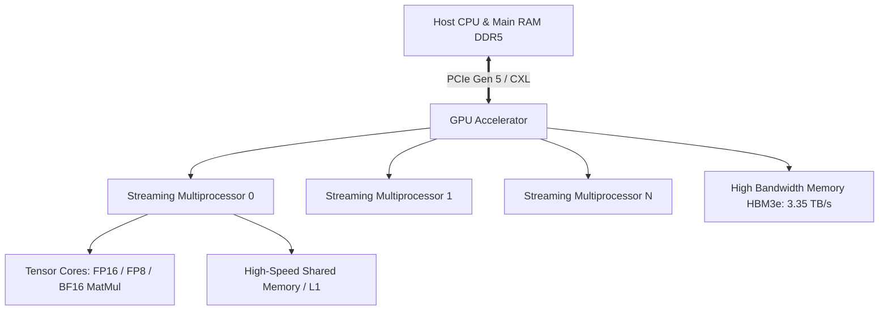

# Computer Systems & Architecture

Modern AI workloads demand massive throughput, making understanding CPU cache hierarchies, GPU SIMT (Single Instruction Multiple Threads), and memory bandwidth indispensable.

## Compute vs Memory Bound Operations

In deep learning, operators are characterized by their **Arithmetic Intensity**:

$$\text{Arithmetic Intensity} = \frac{\text{FLOPs}}{\text{Bytes Transferred}}$$

- **Memory Bound**: Operations like LayerNorm, Softmax, elementwise additions ($\text{Arithmetic Intensity} < 10$).
- **Compute Bound**: General Matrix Multiply (GEMM), Convolutions ($\text{Arithmetic Intensity} > 100$).
