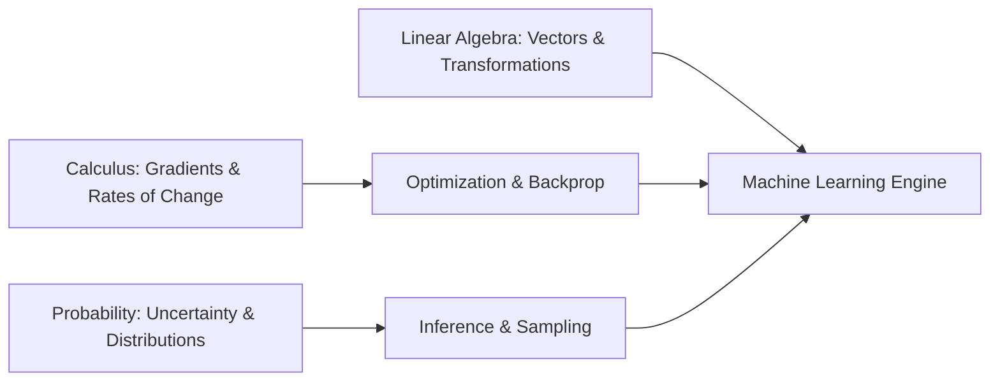

# Mathematics for Computing

Machine learning and modern computer science stand firmly on three pillars of mathematics: **Linear Algebra**, **Multivariable Calculus**, and **Probability & Statistics**.

## The Three Core Pillars

1. **Linear Algebra**: The language of multi-dimensional data, representations, and matrix transformations.
2. **Calculus**: How functions change continuously, enabling backpropagation and parameter optimization.
3. **Probability & Statistics**: Quantifying uncertainty, distributions, likelihoods, and stochastic processes.
